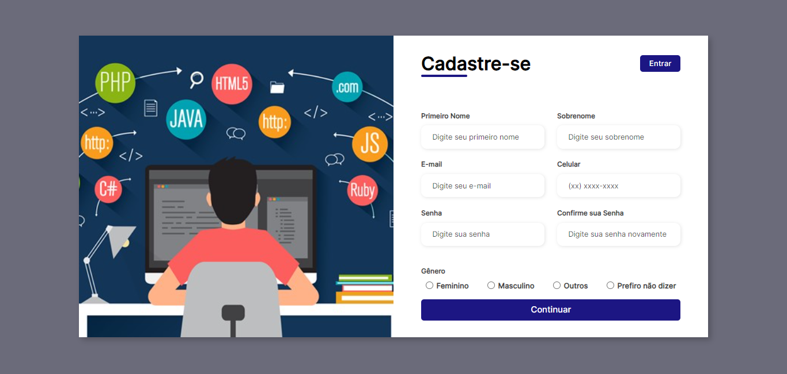
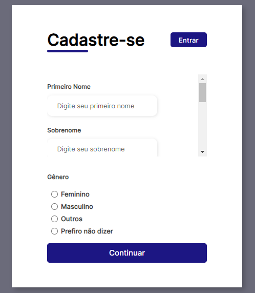

# Formulário Responsivo com HTML, CSS e Bootstrap

Este é um repositório que contém um formulário responsivo desenvolvido utilizando HTML, CSS e o framework Bootstrap. O objetivo deste projeto é demonstrar como desenvolver um formulário moderno e adaptável em diferentes dispositivos, utilizando tecnologias front-end populares.

## Pré-visualização

  
  

## Características

- Design moderno e limpo.
- Layout responsivo que se adapta a dispositivos móveis, tablets e desktops.
- Utilização de classes do Bootstrap para estilização e posicionamento.
- Formulário simples com campos de entrada e botão de envio.

 
